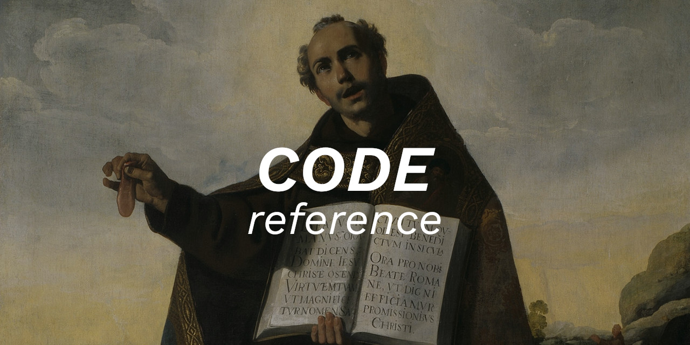

 

    
      
    
    
    
    

Language: <a href="readme-pt.md">PT-BR</a>

In this repository I keep some of my reference information, such as tips, tricks, and details regarding programming languages and technologies that I use in my work.

**If my code has helped you, please consider [sponsoring me](https://github.com/sponsors/melchisedech333) :blue_heart:** 

 

:smiley: Author
---

Sponsor: [melchisedech333](https://github.com/sponsors/melchisedech333) 
Twitter: [Melchisedech333](https://twitter.com/Melchisedech333) 
LinkedIn: [Melchisedech Rex](https://www.linkedin.com/in/melchisedech-rex-724152235/) 
Blog: [melchisedech333.github.io](https://melchisedech333.github.io/) 

 

:scroll: License
---

[ BSD-3-Clause license](./license)

  

## Remember to give me   a beautiful little star :star_struck:

